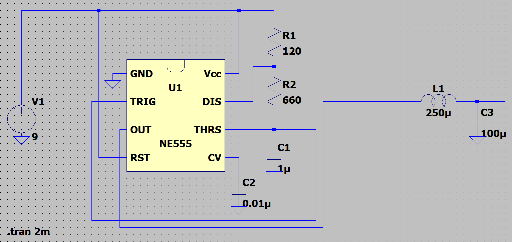
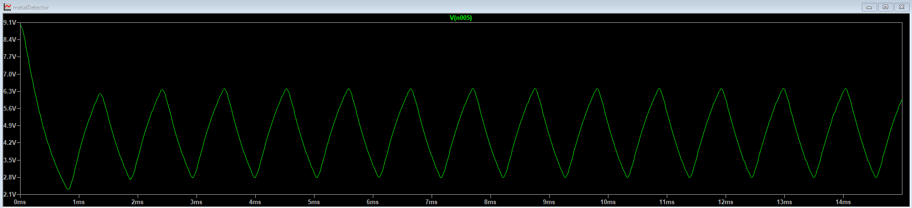

# Metal-detector
This repository is a report (somehow) of my diy metal detector circuit. I think i'll update as a diary of this project adding pictures, analysis and/or toughts.

## Starting from the beginning
Online researches tells that in general a metal detector works with a frequency in a range between few kHz up to 40kHz. Since i don't want to design an analog mixer i've to select a very low frequency (1kHz, i hope will work otherwise ... mixer).

## Basic working principle
There will be 3 coils:
1. TX coil - create a magnetic field inducing current in the metal objects in the affected region;
2. RX coil - receive the magnetic field created by the currents induced in the metal object; 
3. Compensation coil - nulls the magnetic field around the RX coil applying an opposite flowing current.

My idea is to proceed in the following way:
1. Design the oscillator;
2. Interface TX and Comp. coil with the oscillator;
3. Design the RX coil and the relative circuit (ideally will receive only 1kHz in case of metal presence) and hear on a speaker the sound of metal🤘;

### Design the oscillator
In my bachelor's thesis i've designed a Colpitt's oscillator with a BJT but unfortunately it's good for higher frequencies otherwise will need huge capacitors and inductor.
I like simple things so i choose NE555 IC used in astable configuration creating a signal at 1kHz.
At the output there is an LC filter which enable to pass the 1kHz signal (at the end are needed a big capacitor and a big inductor as well but in a much more simpler way).
Below the simulated circuit on LTSpice.

Below the output signal which is more like a triangular wave than a sinusoid this because the -40dB/dec of the filter after the central frequency is not enough to filter out the third harmonic (for an ideal square signal the second harmonic is zero).
